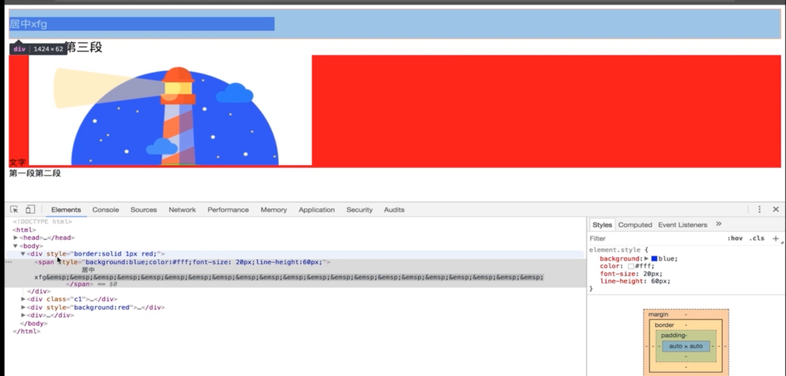
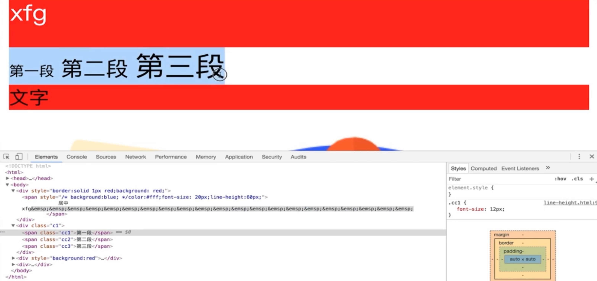
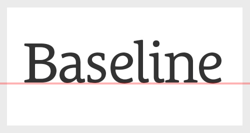
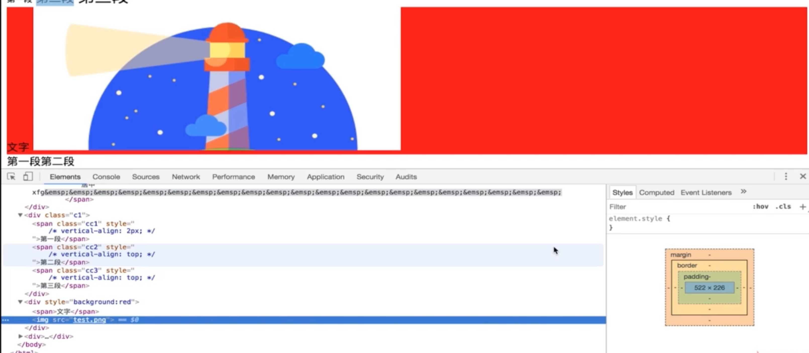

# 行高

## 行高的构成

例子：

```html
<div>
  <span class="c1">inline box xfg 中文</span>
  <span class="c2">inline box</span>
  <span class="c3">inline box</span>
  inline-box
  <span class="c5">inline box</span>
</div>
```

```css
span{
  background: red; 
}

.c1{
  line-height: 20px;
}

.c2{
  line-height: 8px;
}

.c3{
  line-height: 30px;
}

.c5{
  line-height: 20px;
}

```
可以看到css代码中，`line-height`不同


* 为什么行高不同，但渲染高度相同？

涉及到文字的排版，红色背景底下的线叫做底线， 红色背景顶上的线叫做顶线。底线和顶线之间是文本占据的区域。文本是默认baseline，对齐的. `.c3`有最高的`line-height`会把父元素`div`撑开，`div`高度变成30px。 

文本的大小是有`font-size`决定的。 

其实，还可以观察到，字体是垂直居中的（虽然不明显）。所以，这也是垂直居中的一种方式，**设置容器中的子元素**`line-height`, 撑开div的高度，可以使文字垂直居中。

## 行高相关的现象和解决方案

### Demo 1



可以的看到外层的`div`被子元素`line-height:60px`撑开， 并且`div`中的字是垂直居中的。(line-height 高于字体的高度)

### Demo 2



可以看到字体大小不一样（`font-size`不同），但是按照`baseline`对齐的(默认是`baseline`对齐，)



[MDN Vertical Align](https://developer.mozilla.org/en-US/docs/Web/CSS/vertical-align)

### Demo 3



* 为什么图片下面有空隙?(图片3px空隙问题)

原因是跟Demo1和Demo2 是一样的， 图片是`inline`元素，跟上面字体一样，`inline`元素默认按照`baseline`对齐

 解决方法： `vertical-align: bottom;`(按底线对齐 )
