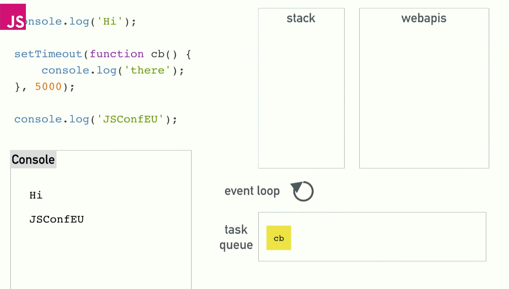

# 异步

## 问题

* 什么是单线程，和异步有什么关系
* 什么是 event-loop
* 是否用过jQuery 的Deferred
* Pormise 的基本使用和原理 
* 介绍一下asyncc/await(和Promise的区别、联系)
* 总结以下当前JS解决异步的方案


## 什么是单线程，和异步的关系

* 单线程 - 只有一个线程，同一时间只能做一件事
* 原因 - 避免DOM渲染的冲突
	* 浏览器需要渲染DOM
	* JS可以修改DOM结构
	* JS执行的时候，浏览器DOM渲染会暂停
	* 两段JS也不能同时执行（都修改DOM就冲突了）
	* webworker支持多线程，但是不能访问DOM
* 解决方案 - 异步
* 异步的问题
	* 没有按照书写方式执行，可读性差
	* callback中不容易模块化

* 问题解答
	* 单线程就是同时只做一件事
	* 原因就是为了避免DOM渲染冲突
	* 异步是一种"无奈"的解决方案，虽然有很多问题

```
var i, sum = 0;
for(i = 0; i < 10000; i++){
	sum += i;
}

console.log(sum);

console.log(1)
alert('hello') //发生阻塞，alert不处理，JS执行和DOM渲染会暂时卡顿
console.log(2)


console.log(100)
setTimout(function(){  // 异步
	console.log(200)
},0)

console.log(300)
console.log(400)

// 100 300 400 200


console.log(100)
$.ajax({						//异步
	url: 'xxxx',
	success: function(result){
		console.log(result)
	}
})

console.log(300)
console.log(400)


```

## 什么是event-loop（事件循环）

[JSConf Event loop](https://www.youtube.com/watch?v=8aGhZQkoFbQ&t=319s)


* event-loop, JS实现异步的具体解决方案
* 同步代码，直接执行
* 异步函数先放在异步队列中
* 待同步函数执行完毕，轮询执行异步队列函数


### 问题

* 什么是异步队列，何时被放入异步队列
*　轮询过程


## jQuery Deferred

* jQuery 1.5的变化
* 引入jQuery Deferred
* 引入Promise 概念  

```

// jQuery 1.5 之前
var ajax = $.ajax({
	url: 'data.json',
	success: function(){
		console.log('success1')
		console.log('success2')
		console.log('success3')
	},
	error: function(){
		console.log('error')
	}
})

console.log(ajax) //返回一个XHR对象


//jQuery 1.5之后

var ajax = $.ajax({
	ajax.done(function(){
		console.log('success1')
	})
	.fail(function(){
		console.log('error')
	})
	.done(function(){
		console.log('success2')
	})

})

console.log(ajax) //返回一个deferred 对象

//另外一个种写法，很像Promise

var ajax = $.ajax('data.json')
ajax.then(function(){
		console.log('success1')
	}, function(){
		console.log('error1')
	})
	.then(function(){	
		console.log(success1'')
	}, function(){
		console.log('error2')
})

```

### jQuery 1.5的变化

* 无法改变JS异步和单线程的本质
* 只能从写法上杜绝callback这种形式
*　它是一种语法糖形式，但是解耦了代码
* 很好的体现：　开放封闭原则


