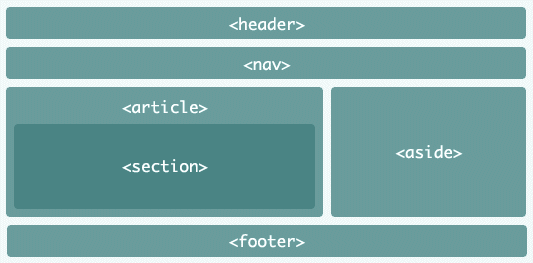

# HTML

## 目录

* HTML 常见元素和理解
* HTML版本
* HTML元素分类
* HTML元素嵌套关系
* HTML元素默认样式和定制化

[h5](https://www.w3.org/TR/2011/WD-html5-20110525/content-models.html#metadata-content-0)
## HTML常见的元素

### head里出现的元素

* meta
* title
* style
* link
* script
* base

### body里出现的元素

* div/section/article/aside/header/footer (区域)
* p (段落)
* span/em/strong （行内）
* table/thead/tbody/tr/td (表格)
* ul/ol/li/dl/dt/dd (列表)
* a
* form/input/select/textarea/button (表单)


`<em>`: emphasis(强调)


`<aside>`: sidebars(侧栏 )


`<thead>`: head of table


`<td>`: defines a cell of a table that contains data 


`<dl>`: a description list


`<dt>`: specifies a term in a description or definition list


`<dd>`: provides the details about or the definition of the preceding term 


* `<meta charset="utf-8">`
	* charset(characterset) 字符集
* `<meta name="viewport" content="width=device-width, initial-scale=1.0, maximum-scale=1.0, user-scalable=no">`

 [viewport MDN](https://developer.mozilla.org/en-US/docs/Mozilla/Mobile/Viewport_meta_tag)

如果一个移动屏幕宽640px, 没有`width=device-width`，页面可能被渲染成一个980px的虚拟视口，并且将缩小去适应到640px的宽度。
 


* `<base href="/">`
 * 指定基础路径, 所有路径都是以这个路径为基准 

### HTML重要的属性

* a[href, target]

```
<a href="http://www.qq.com">腾讯网</a>
<a href="http://www.taobao.com" target="_blank">淘宝网</a> <!--打开一个新标签 -->

```
* img[src, alt]
* table td[colspan, rowspan]

```
...
  <td colspan="2">数据1</td> <!--占据两列-->
...
  <td rowspan="2">数据1</td> <!--占据两行-->
...

```
* form[target, method, enctype]

```
<form method="GET" action="http://www.qq.com"></form>
```

* input[type, value]

```
 <p>
    <input type="text" name="text1" />
</p>
<p>
    <input type="password" name="password" />
</p>
<p>
    <input type="radio" name="radio1" id="radio1-1" />  <!--这里两个input的name是相同的，代表两个选项只能选一个-->
    <label >选项一</label>
    <input type="radio" name="radio1" id="radio1-2" />
    <label for="radio1-2">选项二</label> <!--这里的for可以让label和input里id进行关联，选label里的字，可以选中input-->
</p>
```

* button[type]

```
<button type="button">普通按钮</button>
<button type="submit">提交按钮一</button>  <!--将表单进行提交-->
<input type="submit" value="提交按钮二"/> 
<button type="reset">重置按钮</button>

```

* select > option[value]
* label[for]

[简单的demo](https://qinjingfei.github.io/demo/etc/html/1.html)

### 如何理解HTML

* HTML "文档"
* 描述文档的“结构”
* 有区块和大纲


## HTML版本

* HTML4/4.01(SGML)
* XHTML(XML) 
* HTML5 

### HTML5 新增内容

[new tag in h5](https://www.htmlgoodies.com/tutorials/html5/new-tags-in-html5.html)

[h5 MDN](https://developer.mozilla.org/en-US/docs/Web/Guide/HTML/HTML5)
[h5 cheatsheet](https://www.wpkube.com/html5-cheat-sheet/)

* 新增语义化标签
	* section/article 区域
	* nav 导航
	* aside 不重要内容
	* header/footer 头尾
	* main
	* 等



* 表单增强(新的input类型)
  * 日期、 时间 、 搜索（date, datetime, search）

 
  
* 绘画元素
	* canvas

* 媒体元素
	* video
	* audio
* 离线储存
	* localStorage: 长期储存数据，浏览器关闭后数据不丢失
	* sessionStorage: 浏览器关闭后自动删除

* 新技术
	* websocket
	* webworker
	* Geolocation 等


##  HTML元素分类

* 按默认样式分
  * 块级元素 block(占据一整行)
  * 行内元素 inline
  * inline-block
* 按内容分


[h5](https://www.w3.org/TR/2011/WD-html5-20110525/content-models.html#metadata-content-0)

## HTML 元素嵌套关系

* 块级元素可以包含行内元素
* 块级元素不一定能包含块级元素
  * p 不能包含div
* 行内元素一般不能包含块级元素
  * a > div合法


## HTML元素默认样式
 
 * 默认样式的意义
 * 默认样式带来的问题
 * CSS Reset

## 题目

* HTML XHTML HTML5的关系
  * HTML属于SGML
  * XHTML属于XML, 是HTML进行XML严格化的结果

* HTML5有什么变化
  * 新的语义化元素
  * 表单增强
  * 新的API(离线、音视频、图形、实时通信、本地储存、设备能力)

 * em和i有什么区别
   * em是语义化的标签，表强调
   * i是纯样式的标签、表斜体

 * 语义化的意义是什么
 	* 开发者容易理解
 	* 机器容易理解结构(搜索引擎)
 	* 有助于SEO
 * 哪些元素可以自闭合
 	* 表单元素input
 	*  图片img
 	* br hr
 * HTML和DOM的关系
 	* HTML是‘死’的
 	* DOM由HTML解析而来, 是活的
 	* JS可以维护DOM
 * property和attribute的区别
 	* porperty特性， 是‘死’的
 	* attribute属性，是‘活’的
[attribute-vs-property](http://lucybain.com/blog/2014/attribute-vs-property/)

JS DOM 有properies(特性)，properties可以是不同的类型(boolean, string etc). Properties 可以用 jQuery的prop方法来获得

Attributes 存在HTML中，而不是DOM. Atrributes和properties非常的相似，但没有properties好。 一个attribute 只能是string，没有其它类型。

```
<input type="checkbox" checked=true/>

$('input').prop('checked'); // returns true
$('input').attr('checked'); // returns "checked"

```

如果一个元素有默认的值，attribute会显示默认值，即使值发生了改变。

```
<input type="text" name="username" value="user123">

$('input').prop('value', '456user');
$('input').prop('value'); // returns "456user"
$('input').attr('value'); // returns "user123"

```

在你想要设置一个自定义的attribute时候（当没有property关联），attributes会有用

```
<input type="text">

$('input').prop('customAttribute', 'something custom');
$('input').prop('customAttribute'); // returns "something custom"
$('input').attr('customAttribute'); // returns undefined

```

* form的作用有哪些
	* 直接提交表单
	* 使用submit/reset按钮
	* 便于浏览器保存表单
	* 第三方库可以整体提取值
	* 第三方库可以进行表单验证