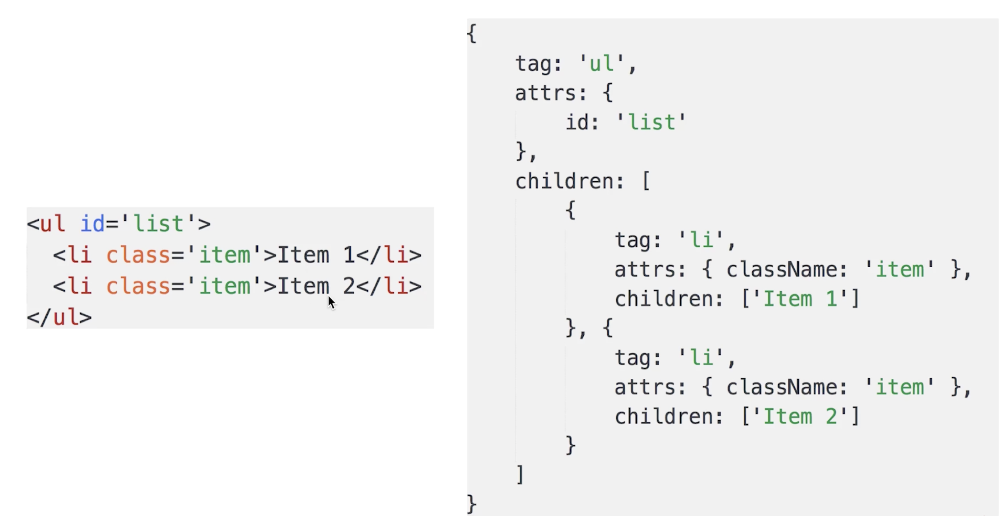
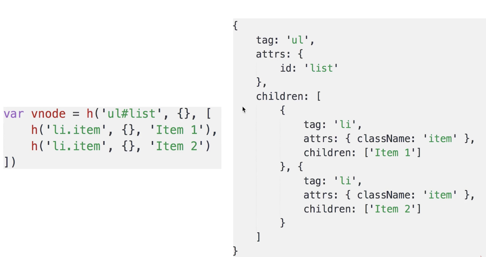

# Virtual Dom

## 什么是Virtual Dom

* virtual dom, 虚拟DOM
* 用JS模拟DOM结构
	* DOM 操作非常“昂贵”
	* 将DOM对比操作放在JS层，提高效率


用JS模拟DOM结构


[Understanding the Virtual DOM](https://codingexplained.com/coding/front-end/vue-js/understanding-virtual-dom)

[Vue.js 2.0新增的虚拟DOM是怎么回事？](https://www.zcfy.cc/article/what-s-new-in-vue-js-2-0-virtual-dom)

## snabbdom

Example

```javascript
var snabbdom = require('snabbdom');
var patch = snabbdom.init([ // Init patch function with chosen modules
  require('snabbdom/modules/class').default, // makes it easy to toggle classes
  require('snabbdom/modules/props').default, // for setting properties on DOM elements
  require('snabbdom/modules/style').default, // handles styling on elements with support for animations
  require('snabbdom/modules/eventlisteners').default, // attaches event listeners
]);
var h = require('snabbdom/h').default; // helper function for creating vnodes

var container = document.getElementById('container');

var vnode = h('div#container.two.classes', {on: {click: someFn}}, [
  h('span', {style: {fontWeight: 'bold'}}, 'This is bold'),
  ' and this is just normal text',
  h('a', {props: {href: '/foo'}}, 'I\'ll take you places!')
]);
// Patch into empty DOM element – this modifies the DOM as a side effect
patch(container, vnode);

var newVnode = h('div#container.two.classes', {on: {click: anotherEventHandler}}, [
  h('span', {style: {fontWeight: 'normal', fontStyle: 'italic'}}, 'This is now italic type'),
  ' and this is still just normal text',
  h('a', {props: {href: '/bar'}}, 'I\'ll take you places!')
]);
// Second `patch` invocation
patch(vnode, newVnode); // Snabbdom efficiently updates the old view to the new state

```

关键函数 `h`, `patch`


* `snabbdom/h`

It is recommended that you use `snabbdom/h` to create vnodes. `h` accepts a tag/selector as a string, an optional data object and an optional string or array of children.

```javascript
var h = require('snabbdom/h').default;
var vnode = h('div', {style: {color: '#000'}}, [
  h('h1', 'Headline'),
  h('p', 'A paragraph'),
]);
```



* patch 

The `patch` function returned by `init` takes two arguments. The first is a DOM element or a vnode representing the current view. The second is a vnode representing the new, updated view.

patch(container, vnode)

patch(vnode, newVnode)

[snabbdom github](https://github.com/snabbdom/snabbdom)


## diff 算法

找出本次DOM必须更新的节点来更新，其他的不更新

### diff实现过程

* patch(container, vnode)
* patch(vnode, newVnode)